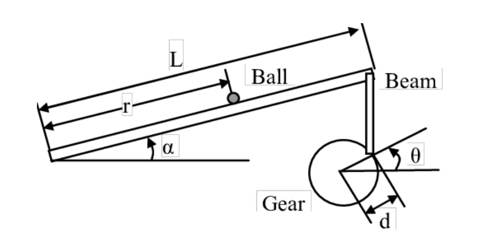

# Ball and Beam Control System
This program is a design for ball and beam control system as a part of "Linear Control Systems" course.
A full description containing output plots is included in Persian.

## Physical Setup Schematic

## Design Criteria
- Overshoot < 5%
- Settling time < 3 second
